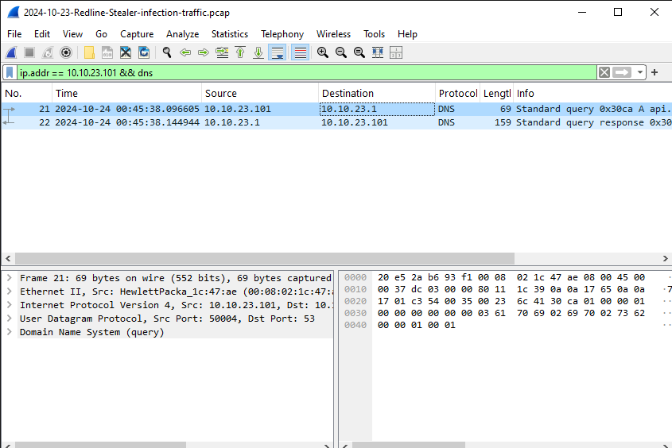
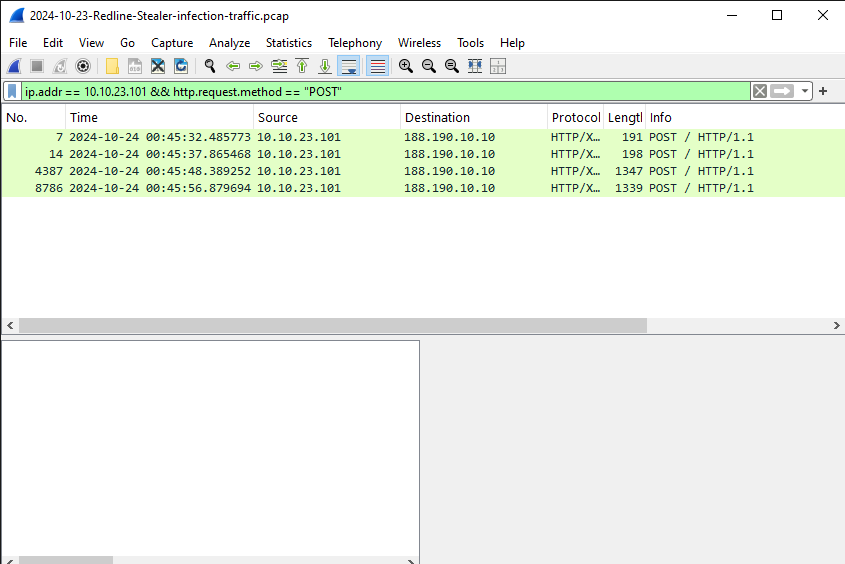
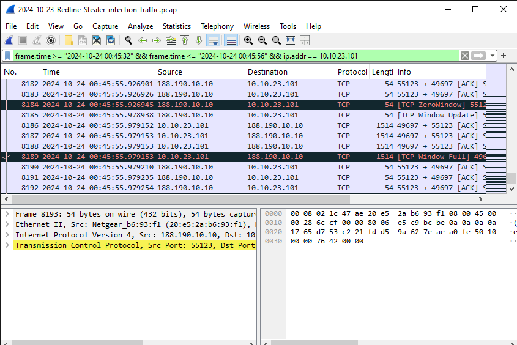
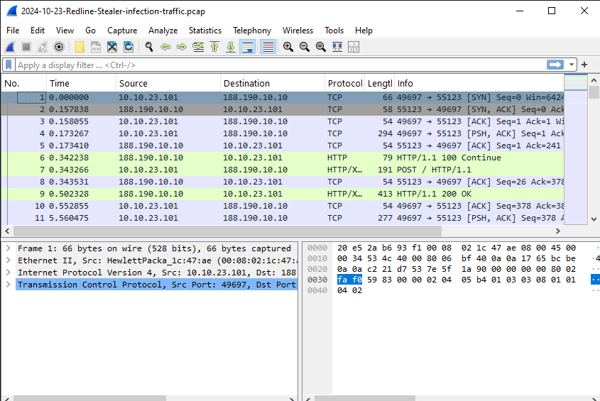

# 🧩 Cybersecurity Project 1 — Network Traffic Analysis with Wireshark

**Analyst:** Mohamed Asmy  
**Date:** 2025-10-15  
**Tool:** Wireshark v4.x  
**Case File:** `2024-10-23-Redline-Stealer.pcap`  
**Source:** [Malware-Traffic-Analysis.net](https://www.malware-traffic-analysis.net/2024/10/23/index.html)

---

## 📘 Table of Contents
1. [🧭 Project Overview](#-project-overview)
2. [🎯 Objective](#-objective)
3. [🧰 Tools Used](#-tools-used)
4. [📂 Evidence Overview](#-evidence-overview)
5. [🌐 Traffic Summary](#-traffic-summary)
6. [🚨 Suspicious Findings](#-suspicious-findings)
7. [⏱️ Timeline Analysis](#-timeline-analysis)
8. [🧩 Indicators of Compromise (IOCs)](#-indicators-of-compromise-iocs)
9. [🧾 Conclusion](#-conclusion)
10. [🛡️ Recommendations](#-recommendations)
11. [🔍 Wireshark Analysis Evidence](#-wireshark-analysis-evidence)
12. [🖼️ Screenshots & Evidence](#-screenshots--evidence)
13. [🎓Learning Outcomes](#-learning-outcomes)
14. [🏁 Project Summary](#-project-summary)

---

## 🧭 Project Overview

This project involves analyzing a **suspicious network capture (PCAP)** to identify potential **malicious communication, data exfiltration, or C2 activity**.  
The analysis uses **Wireshark** to trace HTTP, DNS, and TCP patterns associated with **Redline Stealer** malware.

---

## 🎯 Objective

To investigate a suspicious `.pcap` file and detect indicators of compromise by:
- Identifying unusual or repetitive traffic patterns
- Detecting DNS queries to malicious domains
- Finding POST/GET HTTP requests that transmit data externally
- Correlating the timeline of the malicious session

---

## 🧰 Tools Used

| Tool                  | Purpose                         |
|-----------------------|---------------------------------|
| **Wireshark v4.x**    | Network packet capture analysis |
| **Markdown & GitHub** | Documentation and reporting     |

---

## 📂 Evidence Overview

| File Name                         | Source                       | Type | Password          | Notes                            |
|-----------------------------------|------------------------------|------|-------------------|----------------------------------|
| `2024-10-23-Redline-Stealer.pcap` | Malware-Traffic-Analysis.net | PCAP | infected_20241023 | Contains Redline Stealer traffic |

---

## 🌐 Traffic Summary

| Src IP       | Dst IP        | Protocol | Info            | Notes                       |
|--------------|---------------|----------|-----------------|-----------------------------|
| 10.10.23.101 | 188.190.10.10 | HTTP/XML | POST / HTTP/1.1 | Outbound suspicious POST    |
| 10.10.23.101 | 10.10.23.1    | DNS      | Query for `api.ip.sb` | Domain reconnaissance |

---

## 🚨 Suspicious Findings

| # | Observation                  | Description                                                 |
|---|------------------------------|-------------------------------------------------------------|
| 1 | Multiple HTTP POST requests  | Consistent outbound POSTs from internal host to external IP |
| 2 | Suspicious DNS query         | `api.ip.sb` queried, likely reconnaissance or IP check      |
| 3 | XML data transfer            | POST payload contained XML content typical of C2 data       |
| 4 | Periodic connection attempts | Suggests beaconing behavior                                 |

---

## ⏱️ Timeline Analysis
| Time (s)  | Source IP    | Destination IP | Event                |
|-----------|--------------|----------------|----------------------|
| 0.343     | 10.10.23.101 | 188.190.10.10  | Initial HTTP POST    |
| 5.722     | 10.10.23.101 | 188.190.10.10  | Second POST detected |
| 10.292    | 10.10.23.101 | 188.190.10.10  | Large POST payload   |
| 18.783    | 10.10.23.101 | 188.190.10.10  | Continued beaconing  |

---

## 🧩 Indicators of Compromise (IOCs)

| Type       | Value         | Description                     |
|------------|---------------|---------------------------------|
| IP Address | 188.190.10.10 | Redline Stealer C2 Server       |
| Domain     | api.ip.sb     | Used for host IP reconnaissance |
| Host       | 10.10.23.101  | Infected internal workstation   |

---

## 🧾 Conclusion

The analysis confirms that the internal host **10.10.23.101** communicated with a known **Redline Stealer C2 server (188.190.10.10)**.  
Multiple HTTP POST requests containing XML data and DNS queries to `api.ip.sb` indicate **data exfiltration** and **C2 activity**.  
This confirms a **malware infection and potential credential theft**.

---

## 🛡️ Recommendations

- Isolate the affected host immediately.  
- Block `188.190.10.10` and `api.ip.sb` at the firewall.  
- Run a full malware scan and collect endpoint logs.  
- Rotate all user credentials on the compromised system.  
- Conduct user awareness training about phishing downloads.  

---

## 🔍 Wireshark Analysis Evidence

### A. Useful Display Filters

| Purpose                | Filter Command                      | Description                                   |
|------------------------|-------------------------------------|-----------------------------------------------|
| Show all HTTP traffic  | `http`                              | Displays all HTTP requests/responses          |
| Focus on infected host | `ip.addr == 10.10.23.101`           | Filters packets related to compromised device |
| Identify C2 server     | `ip.addr == 188.190.10.10`          | Tracks malicious outbound traffic             |
| Find POST requests     | `http.request.method == "POST"`     | Shows data uploads to external servers        |
| DNS activity           | `dns.qry.name contains "api.ip.sb"` | Detects suspicious DNS queries                |
| TCP streams            | `tcp.stream eq 0`                   | Follows a single TCP conversation             |

---

### B. How to Analyze

1. Open `.pcap` in Wireshark  
2. Set **Time Reference** on first suspicious packet (right-click → “Set Time Reference”)  
3. Apply each filter above sequentially  
4. Right-click on a POST request → “Follow → TCP Stream”  
5. Review payload for stolen credentials or encoded data  

---

## 🖼️ Screenshots & Evidence

| #      | Description                    | Screenshot                                  |
|--------|--------------------------------|---------------------------------------------|
| Fig. 1 | DNS query to `api.ip.sb`       |        |
| Fig. 2 | HTTP POST request to C2 server |        |
| Fig. 3 | TCP stream of Redline payload  |       |
| Fig. 4 | Full traffic overview timeline |  |

---

## 🎓 Learning Outcomes

By completing this project, the analyst (Mohamed Asmy) learned to:
- Use Wireshark filters to trace malicious activity  
- Identify C2 and exfiltration behavior in PCAP files  
- Build a professional incident report  
- Correlate DNS, HTTP, and TCP activity in network forensics  
- Document findings for cybersecurity investigation reports  

---

### 🏁 Project Summary

> **Project Name:** Network Traffic Analysis with Wireshark  
> **Category:** Cybersecurity Forensics / Threat Hunting  
> **Level:** Beginner–Intermediate  
> **Duration:** ~3–4 hours  
> **Status:** ✅ Completed  

---

**© 2025 Mohamed Asmy — Cybersecurity Portfolio Project (CCP1)**  
